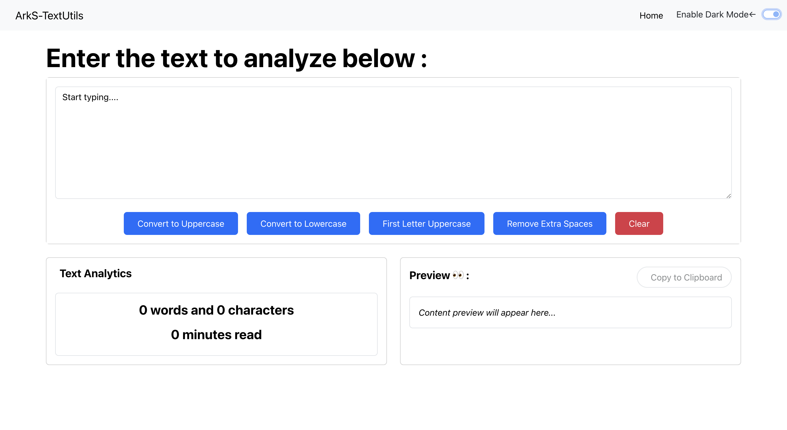
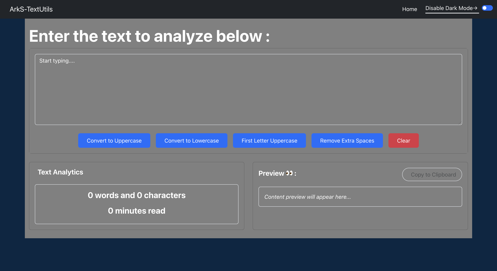

# TextUtils - Text Manipulation Tool 🔠

[](https://ark-techy.github.io/ArkS-TextUtils-React)
[](https://reactjs.org/)

My first React app! A text utility tool to manipulate text in real-time.

## Features ✨
- UPPERCASE/lowercase conversion
- Remove extra spaces 🧹
- Word & character counter 📊
- Copy to clipboard 📋
- Dark/Light theme toggle 🌓
- Live text preview

## Screenshots 🖼️
  
*Light Mode*

  
*Dark Mode*

## Installation ⚙️
```bash
git clone https://github.com/Ark-techy/ArkS-TextUtils-React.git
cd ArkS-TextUtils-React
npm install
npm start
